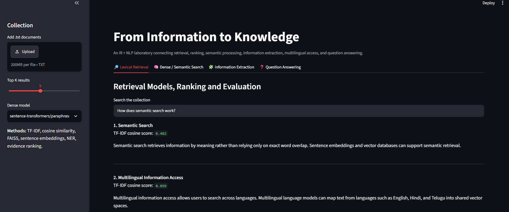
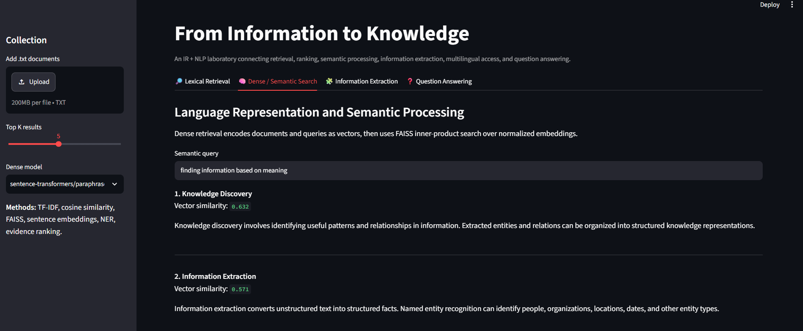
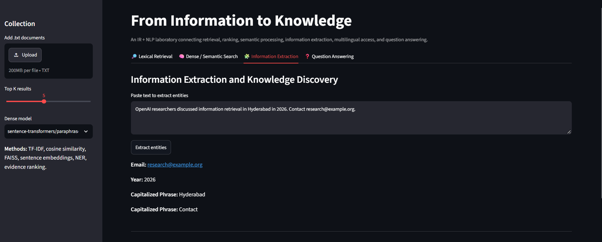
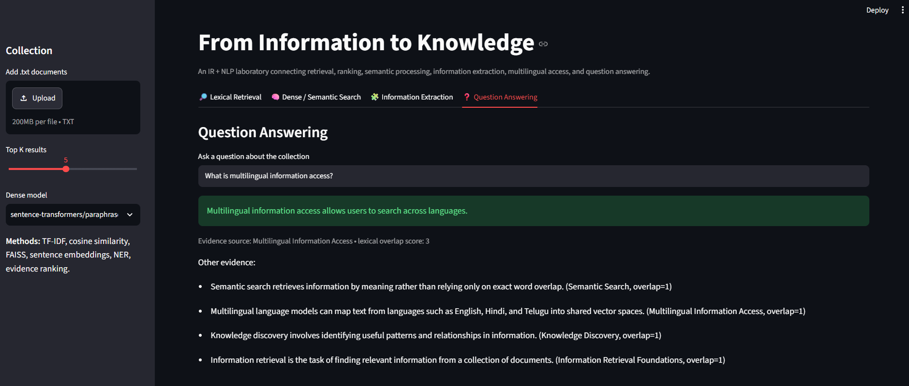
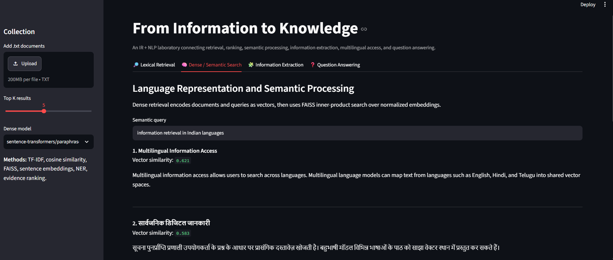

# From Information to Knowledge: IR + NLP Knowledge Search

An end-to-end educational/research prototype connecting **Information Retrieval (IR)** with **Natural Language Processing (NLP)**, information extraction, semantic search, multilingual access, and question answering.

## Topics covered

- **Foundations of Information Retrieval:** document collections, queries, scoring and ranked retrieval
- **Retrieval Models, Ranking and Evaluation:** TF-IDF + cosine similarity, ranked results and relevance scores
- **Foundations of NLP:** text normalization and vector-based text representation
- **Language Representation and Semantic Processing:** dense sentence embeddings
- **Information Extraction and Knowledge Discovery:** named-entity extraction with spaCy, with a dependency-free fallback
- **Semantic Search and Question Answering:** FAISS vector retrieval and a lightweight evidence-ranking QA baseline
- **Multilingual and Indian-Language Information Access:** multilingual sentence-transformer option plus English/Hindi/Telugu sample documents
- **Text retrieval, information extraction and semantic search** in one Streamlit interface

## Technical stack

**Python, NumPy, scikit-learn, NLTK/spaCy-compatible NLP workflow, Hugging Face Sentence Transformers, FAISS, Streamlit, open text collections, and retrieval-evaluation concepts such as Precision@K, Recall@K, MRR and nDCG.**

The implementation includes:
- TF-IDF and cosine similarity for a transparent lexical baseline
- Sentence Transformers for dense representations
- FAISS `IndexFlatIP` over normalized vectors for vector retrieval
- spaCy NER when `en_core_web_sm` is available
- a lightweight extraction fallback
- an evidence-ranking QA baseline

## Architecture

```text
Documents
   ├──► TF-IDF ──► Cosine Similarity ──► Ranked Lexical Retrieval
   ├──► Sentence Transformer ──► FAISS ──► Dense Semantic Retrieval
   └──► spaCy / extraction rules ──► Entities / structured evidence

User Question ──► Evidence ranking ──► Extractive answer + source
```

## Run locally

```bash
python -m venv venv
```

Windows PowerShell:
```powershell
Set-ExecutionPolicy -Scope Process -ExecutionPolicy Bypass
.env\Scripts\Activate.ps1
```

Then:

```bash
pip install -r requirements.txt
python -m spacy download en_core_web_sm
streamlit run app.py
```

The first dense-search query downloads the selected Hugging Face model, so internet access is needed for that first model download.

## Example queries

- `How does semantic search work?`
- `How are retrieval systems evaluated?`
- `What is BM25?`
- `finding documents by meaning`
- `multilingual information access`

## Evaluation / research extension

The app exposes ranked retrieval, making it suitable for an evaluation lab. A next step is to create labelled query-document relevance judgments and calculate:

- Precision@K
- Recall@K
- Mean Reciprocal Rank (MRR)
- nDCG

`ir_measures` and standard TREC-style relevance judgments can be used for reproducible evaluation.

## Open-source data

The included corpus is intentionally small so the project runs immediately. For a research experiment, replace it with an open benchmark such as **TREC, BEIR, or MIRACL** and evaluate with `ir_measures` / TREC-style qrels.

## Data structures and algorithms

The project makes algorithmic structure visible through:
- sparse TF-IDF matrices
- similarity ranking
- vector indexes
- top-K selection
- set-overlap evidence ranking
- document collections and entity lists

## Limitations

This is an educational prototype, not a production search engine. The lexical model depends on vocabulary overlap; dense retrieval depends on the selected embedding model; the QA module is an evidence-ranking baseline rather than a generative LLM; and the included scores are not a substitute for a labelled benchmark.

## Research direction

A natural research question is:

> How does dense multilingual retrieval compare with classical lexical retrieval for short, domain-specific information needs?

A controlled experiment can compare TF-IDF, BM25 and dense retrieval using the same query set and relevance judgments.

## Screenshots

### 1. Lexical Retrieval
TF-IDF-based lexical retrieval ranks documents according to query-document similarity.



### 2. Dense Semantic Search
Dense retrieval uses Sentence Transformers and FAISS to retrieve documents based on semantic similarity.



### 3. Information Extraction
Named entities and structured information are extracted from unstructured text using spaCy and lightweight fallback rules.



### 4. Question Answering
The system ranks evidence sentences and returns an extractive answer together with its source document.



### 5. Multilingual Information Access
The multilingual retrieval interface demonstrates information access across English, Hindi, and Telugu content.


